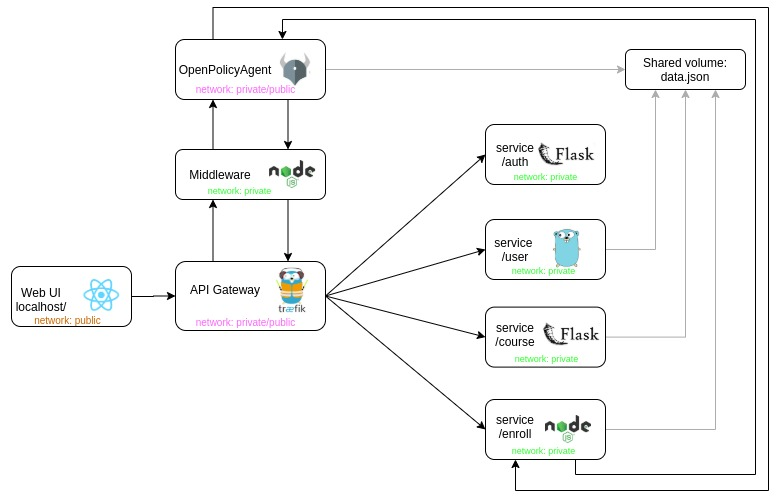

# OPA Demo Application

This application shows how [Open Policy Agent](https://www.openpolicyagent.org/) (OPA) 
can be used to **manage access** and other organizational policies in a very simple university 
course management system.

The course management system is divided into a set of separate services, each implemented
in different programming language. Access to these services is managed by an API gateway which then
uses Open Policy Agent as a middleware. To demonstrate that OPA can also communicate directly
with the end services, the Enroll service implements a direct request asking OPA about current
capacity of a course.

You can find a more vivid decription of the application, as well as lessons learned during its 
development in our blog post.

## Policies
We implement several policies for our system, including:

* only a teacher teaching a specific course can modify its details
* students can enroll in a course only if there is still some free space left and if the enrollment
  doesn't result in schedule conflics
* maximal student capacity of each course depends on the number of teachers assigned to it; to
  demonstrate the rule on a low number of students, the rule allows 2 students per teacher

Rule definitions can be found in `./opa/policy.rego`. We discuss how access rules are defined in 
OPA in [one of our blog artiles](https://www.profiq.com/decoupling-policies-from-your-software-with-open-policy-agent-part-1/).

## Requirements

In order to run the application locally, you need to have **docker** and **docker-compose** 
installed on your machine.

## Architecture

As mentioned, the course university system consists of several services written in different
programming languages. These services are hidden behind an API gateway that uses OPA as a 
middleware to manage access. Each service, OPA and the API gateway are encapsulated in their own
docker container. Additionaly, we define a shared docker volume acting as a permanent storage
for course and user data. 

## Running the application

1. Clone this git repository and change your working folder:
   > `git clone git@github.com:profiq/opa-demo-app.git && cd opa-demo-app`
2. Build and deploy predefined docker containers, volumes and networks locally with **docker-compose**
   > `docker-compose up --build`

First deployment might take several minutes. When finished, 
you can easily access the app through your web browser by visiting
[http://local.profiq.com/](http://local.profiq.com/).

## Updating OPA policies

Since we run Open Policy Agent in an HTTP server mode, you can easily redefine
current policies without restart by making an appropriate PUT request, for example via `curl`:

> `curl -X PUT --data-binary @policy.rego localhost:8181/v1/policies/root/policy.rego`

where `@policy.rego` refers to a file containing new policy definitions.

## Editing frontend

If you want to play with the application frontend, we offer a simple option of running
it externally outside of the predefined docker container. You just need to have **yarn** installed
on your machine.

### Available commands

After you `cd` to the `frontend/` directory you can run

> `yarn install`

to install all required dependencies. Then you can use

> `yarn start`

to start a development server running on [http://localhost:3000](http://localhost:3000) by default.
The frontend reloads automatically if you edit its code. 
You will also see any lint errors in the console.

Finally the command

> `yarn build`

builds the app for production and places the results into the `./build` directory.
It correctly bundles React in production mode and optimizes the build for the best performance.
